<div align="center">



**AI 코딩 세션을 위한 관제탑**<br>
Claude Code·Codex 세션, git 워크트리, Linear 티켓을 레이더 한 화면에.

[](package.json)
[](web/src)
[](server)
[](vite.config.ts)
[](https://github.com/chaehy5665/atc/releases/latest)
[](LICENSE)


[English](README.md) · **한국어**

[이륙 준비](#-ready-for-takeoff) · [화면](#화면) · [용어](#용어) · [실행](#실행) · [폴더별 문서](#폴더별-문서) · [폴더 구조](#폴더-구조) · [변경 기록](CHANGELOG.ko.md)

</div>

로컬 ATC 웹. 어떤 세션(팀)이 어떤 워크트리를 점유하고, 그 워크트리가 어떤 Linear 티켓을 처리 중인지 한 화면에 보여준다.

- 실행 위치: 이 머신(`/home/c10/projects/atc`), 포트 `7700`
- 접속(맥에서): `ssh -L 7700:localhost:7700 <host>` 후 `http://localhost:7700`
- 읽기 전용 ATC가 기본이다. 워크트리 생성·삭제나 Linear 쓰기는 하지 않는다.

## 🛫 Ready for takeoff?

> **Pre-flight checklist** — Node 24 이상 · Claude Code 또는 Codex · git 워크트리로 일하는 저장소

```bash
npm install
npm run build && npm start      # 🛬 http://localhost:7700
```

Linear 티켓까지 보려면 `.env.local`에 `LINEAR_API_KEY`를 넣는다. 상시 운항(systemd)과 점유 hook은 [실행](#실행)·[점유 hook](#점유-hook)에서.

## 화면

| 화면 | 보여주는 것 |
|---|---|
| RADAR (`#radar`) | 세션 ─ 워크트리 ─ 티켓 3열을 선으로 연결. 주인 없는 워크트리, 워크트리 없는 진행 티켓을 강조 |
| FLIGHT STRIPS (`#strips`) | 세션(ALPHA…, Codex 세션)마다 카드 하나. 상태, 점유 중인 워크트리, 연결된 티켓 |
| FIDS (`#board`) | Linear 상태 열에 티켓 카드. 카드에 점유 팀 배지 |
| 지표 (`#metrics`) | FLIGHT RECORDER 기록으로 본 운용 지표, 2단계 진입 점검, 5분 표본 추이, 일별 표 |
| AIRPORT (`#airports`) | 저장소 등록부. AIRPORT 개설·코드 변경·폐쇄·재개·삭제. 소속 AIRCRAFT와 OUTSTATION으로 와 있는 AIRCRAFT(TRANSIENT) |
| FLEET (`#fleet`) | AIRCRAFT마다 상태, 지금 FLIGHT, 선언한 팀원과 관측한 팀원(최근 14일), 복사할 CREW CHANGE 대기, TYPE RATING, ROUTE, TARGETS와 LOGBOOK 실적(이번 주, 정시, 되돌림, LOS, 최근 FLIGHT), CHECKRIDE(TYPE RATING 근거와 부여·재검토 추천). 프로필 편집, ENTRY INTO SERVICE, CREW BRIEFING, AOG, RETIREMENT, rating 부여·회수 |
| NETWORK (`#network`) | 4단계 읽기 전용 운항 개요: ROUTE MAP은 ROUTE마다 WAYPOINT(Linear 프로젝트 마일스톤)를 잇는 경로를 그린다(지남 ●, 지금 구간 ◉과 진행률·운항 중인 AIRCRAFT, 앞으로 ○. 누르면 완료 기준·FLIGHT·목표일·ETA, [docs/routes.ko.md](docs/routes.ko.md)). ROUTE(Linear 프로젝트)마다 상태별 열린 FLIGHT(Todo·In Progress·In Review), 최근 14일 ARRIVED, 그 ROUTE를 도는 AIRCRAFT, 착륙 대기 중앙값, 프로젝트 목표(목표일·진척·상태). AIRCRAFT마다 TARGETS와 FLEET 카드와 같은 LOGBOOK 실적. 최근 28일 추세: ARRIVED·착륙 대기·되돌림, DISPATCH·SCHEDULE 게이트(날마다 판정 수, 누적 합의율, CROSSCHECK 일치율) |
| DISPATCH (`#dispatch`) | 지금 계획, OCC 메모가 달린 제안 카드와 "승인했을 것 / 거절했을 것" 판정(2b에서는 승인·거절), HELD, IN FLIGHT, 제외된 FLIGHT, 2b·3단계 점검 |
| SCHEDULE (`#schedule`) | OCC SCHEDULE 초안(S1 그림자 운용): S2 진입 점검 패널, "승인했을 것 / 거절했을 것" 판정이 있는 열린 초안 카드, 후보 수(CLASSIFY·PRIORITIZE·CLOSE), 승인한 CLOSE의 "LINEAR에서 직접 DONE" 목록, 최근 7일 표 |
| DOCS (`#docs`) | atc 사용 안내: 소개, 빠른 시작, 개념, 일 맡기기(CHARTER DESK / AD HOC), 판정하기, FLEET, 교신 규칙, 화면, 단계, 문제 해결. `docs/guide/*.md`(한국어)를 그대로 보여 준다 |

## 용어

코드와 API는 왼쪽 이름을 쓰고, 화면은 항공 용어로 보여준다(`web/src/aviation.ts`).

| 코드 | 뜻 | 식별자 | 화면 표기 |
|---|---|---|---|
| `Session` | Claude Code / Codex 세션 하나 | `sessionId` | AIRCRAFT. `TEAM_A` → `ALPHA` (음성 알파벳) |
| `Workspace` | git worktree 하나 (본 체크아웃 포함) | 절대 경로 | STAND |
| `Ticket` | Linear 이슈 | `VOC-191` | FLIGHT NUMBER `VOC191` (브랜치·PR에는 `VOC-191` 그대로) |
| `Claim` | 세션이 워크스페이스를 점유한다는 기록 | `sessionId` + 경로 | STAND 점유. hook·cwd로 확인된 점유는 "IDENTIFIED", 기록 추정은 "ESTIMATED TRACK" |

| 저장소 / 본 체크아웃 | — | 본 체크아웃 경로 | AIRPORT 코드(대문자 4자) / TOWER `VCDO TWR` |

### AIRPORT 등록부

AIRPORT 목록은 `~/.local/state/atc/airports.json`(기계마다 다른 경로가 들어가므로 git 밖)에 있고, AIRPORT 탭이나 API로 관리한다.

- `~/projects` 아래 git 저장소는 자동으로 개설된다. 코드는 이름에서 만든다(첫 글자 + 자음, 예: `tennis` → `TNNS`).
- 그 밖의 저장소는 AIRPORT 탭에서 경로를 넣어 개설한다. 워크트리나 하위 폴더 경로를 넣어도 본 체크아웃을 찾는다. 홈 폴더 밖과 bare 저장소는 안 된다.
- AIRPORT는 **첫 커밋 해시**로 알아본다. 폴더를 옮기거나 이름을 바꿔도 같은 AIRPORT·같은 코드로 이어지고 등록부의 경로만 갱신된다. 같은 첫 커밋의 다른 클론은 `첫커밋~경로해시` id로 따로 개설되고, 여럿 중 옮겨진 것은 폴더 이름이 같은 쪽으로 이어 붙인다. 커밋이 없는 저장소는 경로로 알아본다.
- 폐쇄한 AIRPORT는 RADAR·FLIGHT STRIPS·STAND 목록에서 빠지지만 코드는 계속 예약된다. 삭제는 자동 발견이 아닌(수동 개설) AIRPORT만 된다.

**OUTSTATION**: 세션의 소속 AIRPORT(작업 폴더가 있는 저장소)가 아닌 AIRPORT의 STAND를 점유 중이면 OUTSTATION이다(`server/away.ts`). RADAR AIRCRAFT 블록과 FLIGHT STRIPS 콜사인 옆에 `OUTSTATION TNNS`, 스트립 해당 구간에 `OUTSTATION` 도장, AIRPORT 탭에 `TRANSIENT BRAVO(VCDO)`로 보인다. HANDOFF된 점유와 저장소 밖에서 연 세션은 치지 않는다. CONTROLLER 브리핑의 `traffic[].home`·`away`와 이벤트 `away.started`·`away.ended`로도 나온다.

| API | 하는 일 |
|---|---|
| `GET /api/airports` | 전체 AIRPORT와 상태(`open` 운영 / `closed` 폐쇄 / `missing` 경로 없음) |
| `POST /api/airports` | `{path, code?, name?}` 개설 |
| `PATCH /api/airports/:id` | `{code?, name?, closed?}` 코드·이름 변경, 폐쇄·재개 |
| `DELETE /api/airports/:id` | 등록부에서 삭제 (수동 개설한 것만) |

### FLEET 등록부

팀(AIRCRAFT)은 `~/.local/state/atc/fleet.json`에 적고 FLEET 탭에서 고친다([docs/fleet.ko.md](docs/fleet.ko.md)). `TEAM_X`마다 **CREW COMPLEMENT**(CAPTAIN 아래 팀원 POSITION: backend Opus, `ui-builder`, `ui-qa`, `flash-helper` 등), **TYPE RATING**(`SEC`, `UI`, `DATA`, `DOCS`), **ROUTE**(주 담당 Linear 프로젝트), **TARGETS**(주간 FLIGHT 수, 정시성), 메모를 둔다. 정하지 않은 항목은 vocado `CLAUDE.md` 팀원 규칙에서 온 기본값을 따른다. 보안 작업을 맡을 팀원이 없는 구성(`flash-helper`만)에는 `SEC`를 줄 수 없다. 파일에는 바꾼 것만 저장해 기본값은 코드를 계속 따라간다. planner는 TYPE RATING, 팀원, ROUTE를 쓰고(DISPATCH의 FLIGHT 분류 참고), AOG나 퇴역한 AIRCRAFT는 건너뛴다.

FLEET 탭의 **팀 빌딩**: **ENTRY INTO SERVICE**로 **CONFIGURATION** 템플릿을 골라 새 AIRCRAFT를 들이고, **CREW BRIEFING**으로 그 이름의 새 세션에 붙여 넣을 시작 지시문을 받는다. 세션이 뜨면 atc가 이름으로 연결하며, 세션을 직접 띄우지는 않는다. **AOG**는 사유와 해제 예정일을 남기고 잠시 배정을 멈추고, **RETIREMENT**는 목록에서 뺀다(복귀 가능). `TEAM_X`는 등록번호(REGISTRATION)로 그대로 두고, atc의 말로 팀은 CREW가 모는 AIRCRAFT다.

**관측 CREW와 CREW CHANGE**([docs/fleet.ko.md](docs/fleet.ko.md) 8.3~8.4). 카드마다 선언한 COMPLEMENT 옆에 최근 14일 동안 실제로 본 팀원이 나온다: AIRCRAFT 세션들이 부른 서브에이전트를 agent type·모델별로 묶은 횟수와 마지막 시각. POSITION에 맞추고(`ui-builder`·`ui-qa`·`flash-helper`는 이름으로, Opus이거나 모델 지정이 없는 `general-purpose`·`claude`는 `backend`로), 선언에 없는 타입(`Explore` 등)과 선언했지만 안 쓴 POSITION을 drift로 보여 준다. atc는 세션 메타데이터만 읽는다(`subagents/*.meta.json`의 agent type·모델, 파일 시각, `custom-title.json`). 대화 기록과 작업 설명은 읽지 않는다. agent team처럼 따로 세션으로 도는 팀원은 보이지 않는다. SUPERVISOR가 운항 중인 AIRCRAFT(퇴역 아님, 세션 살아 있음)의 COMPLEMENT를 바꾸면 atc가 CAPTAIN에게 줄 **CREW CHANGE** 지시문(내리고 타는 POSITION과 모델, TYPE RATING 영향)을 `~/.local/state/atc/crew-changes.jsonl`에 `CC-0001`로 남긴다. 카드에서 복사해 붙여 넣고 전달함을 누른다. DISPATCH approval 모드(2b)에서는 카드에서 승인할 수도 있다: 그러면 OCC가 `atcctl crew-change send`로 `[OCC CC-0001] CREW CHANGE · …`를 보내고 CAPTAIN의 `READBACK CC-0001`을 기록한다(10분 넘게 없으면 한 번 다시 보내고 보고). 보내기 전(대기·승인됨)에 또 바꾸면 처음 구성 기준으로 합친 새 지시문이 앞의 것을 대신하고, 이미 보낸 것은 READBACK까지 두며 새 지시문은 그 뒤를 기다린다.

**LOGBOOK**([docs/fleet.ko.md](docs/fleet.ko.md) 7.1~7.2, `server/logbook.ts`): atc가 10분마다 AIRPORT마다 기본 브랜치에 머지된 최근 PR 30건(`gh pr list --state merged`)을 읽고, 새 PR마다 `~/.local/state/atc/logbook.jsonl`에 한 줄씩 추가한다(추가만 함. 키가 `owner/repo#번호`라 재시작 뒤 첫 번에 과거분도 채운다). 한 줄에는 AIRCRAFT(그 FLIGHT의 STAND를 점유한 `TEAM_X` 세션, 모르면 `null`), FLIGHT와 분류, 출발(가장 이른 점유, 또는 PR을 연 시각)·도착(머지) 시각, 팀 소요 시간(착수 → PR을 연 시각, PR 전에 점유가 없으면 모름), 착륙 대기(PR → 머지), Codex 지적 회차, 변경 요청 여부, STAND의 LOS가 들어간다. `Revert "…"` PR이 머지되면 되돌린 PR에 `reverted` 줄을 덧붙인다. FLEET 카드는 TARGETS 옆에 실적을 보여 준다: 이번 주(월요일부터, 로컬 시간) ARRIVED 수, 14일 정시율(팀 소요 시간이 WAKE 기대치 L 60분·M 4시간·H 2일 안, 기대치가 없으면 같은 FLIGHT TYPE·WAKE의 중앙값 이하. 착륙 대기는 넣지 않음), 14일 되돌림과 LOS, 착륙 대기 중앙값, 최근 FLIGHT 5건. 보여 주기만 하고 점수나 배정에 쓰지 않는다.

**CHECKRIDE**([docs/fleet.ko.md](docs/fleet.ko.md) 8.2, `server/checkride.ts`): AIRCRAFT × TYPE RATING마다 그 rating이 필요했던 LOGBOOK FLIGHT를 모은다. FLIGHT의 rating은 `rating:`·Risk 라벨에서, 없으면 SUPERVISOR가 받아들인 SCHEDULE CLASSIFY 초안에서 읽고, 근거마다 출처를 보여 준다. **부여 추천**(30일: 그런 FLIGHT 3건 이상, 되돌림 0, Codex 지적 라운드 평균 3 미만)과 이미 가진 rating의 **재검토 추천**(14일: 되돌림, 또는 2건 이상의 지적 라운드 평균 3 이상)을 낸다. `SEC`는 맡을 수 있는 CREW가 없으면(`canHoldSec`) 이유와 함께 추천하지 않는다. FLEET 탭의 카드 아래에 보이고, 부여·회수는 SUPERVISOR만 누른다. 편집 화면과 같은 `applyPatch` 길로 바꾸고 FLIGHT RECORDER에 `checkride` 줄(누가, 추천 여부, 근거)을 남긴다. 자동으로 부여·회수하지 않는다.

| API | 하는 일 |
|---|---|
| `GET /api/fleet` | TEAM 세션과 등록된 AIRCRAFT 전부(상태, 지금 FLIGHT, 팀원, 자격, 담당 프로젝트, 목표, LOGBOOK 실적 `actuals`, `observedCrew`, `crewDrift`, `pendingCrewChange`)와 자격 목록·기본값·프로젝트 목록·`observedWindowDays`(14)·`dispatchMode`. `pendingCrewChange`는 열린 CREW CHANGE(`status` pending·approved·sent, `message`, `approvedAt`, `sentAt`, `overdue`, `waitingFor`) |
| `POST /api/fleet` | ENTRY INTO SERVICE: `{registration, configuration?, base?, routes?, note?}`(configuration: `general`, `security`, `ui`, `research`) |
| `GET /api/fleet/:registration/briefing` | 새 세션에 붙여 넣을 CREW BRIEFING 문구 |
| `PATCH /api/fleet/:registration` | `{complement?, ratings?, routes?, targets?, base?, note?, aog?, retired?}`. `null`이면 그 항목을 기본값으로. `aog: {reason, until?}`는 잠시 운항 중지, `retired: {reason?}` / `false`는 퇴역·복귀. 운항 중인 AIRCRAFT의 COMPLEMENT를 바꾸면 CREW CHANGE를 남긴다(DISPATCH approval 모드에서 승인한 것만 OCC가 보냄) |
| `GET /api/fleet/crew-changes` | 최근 CREW CHANGE 기록, 새것 먼저(`?registration=TEAM_X&limit=20`). 상태는 `pending`·`approved`·`sent`·`acknowledged`·`delivered`·`superseded`, 시각 `approvedAt`·`sentAt`·`acknowledgedAt`과 보낸 `message` |
| `POST /api/fleet/:registration/crew-change/:id/approve` | SUPERVISOR: 대기 중인 CREW CHANGE를 OCC가 보내도록 승인 → `{ok, change}`. approval 모드(2b)이고 `pending`일 때만, 아니면 409, 없으면 404 |
| `POST /api/fleet/:registration/crew-change/:id/delivered` | 대기·승인된 CREW CHANGE를 CAPTAIN에게 직접 붙여 넣었다고 표시. 없으면 404, 이미 보냈거나 닫혔으면 409 |
| `GET /api/fleet/crew-changes/brief` | OCC: `{mode, approved, waiting, sent, overdue, pending}`(`atcctl crew-change brief`) |
| `GET /api/fleet/crew-changes/:id` | CREW CHANGE 하나와 모드 `{change, mode}`(send-guard가 씀) |
| `POST /api/fleet/crew-changes/:id/send` | OCC: approved → sent(approval 모드), 보낼 `message`를 저장해 `sendTo`와 함께 돌려준다. sent면 같은 문구 다시. 승인 전이거나 그 AIRCRAFT에 READBACK 대기 건이 있으면 409 |
| `POST /api/fleet/crew-changes/:id/readback` | OCC: CAPTAIN의 `READBACK CC-xxxx` → acknowledged(모드 상관없음). sent가 아니면 409 |
| `GET /api/fleet/checkride` | CHECKRIDE 행: AIRCRAFT × TYPE RATING마다 상태(`GRANT`, `REVIEW`, `BLOCKED`, `BUILDING`, `HOLDS`), 이유, 건수, 근거와 기준값 |
| `POST /api/fleet/:registration/checkride` | `{rating, action: "grant" \| "revoke"}`: SUPERVISOR의 rating 부여·회수. FLIGHT RECORDER에 남는다 |
| `GET /api/logbook?aircraft=TEAM_X&days=14` | LOGBOOK 기록, 도착 최신순(`aircraft`는 선택, `days`는 1~90). 마지막으로 읽은 시각과 오류도 |
| `GET /api/routes` | ROUTE MAP(읽기 전용): `routes`마다 단계별 열린 FLIGHT, `aircraft`, 28일 완료 `rate`, `waypoints`(상태, Linear status, 진행률, 목표일, 완료 기준 `criteria`, `flights`, `counts`, `late`, `eta`). 마일스톤이 없는 ROUTE는 `waypoints: []`. `ok`·`milestones`·`error`가 무엇을 읽었는지 말한다 |
| `GET /api/network` | NETWORK 개요(읽기 전용): `routes`(상태별 열린 FLIGHT, `arrived14`, `aircraft`, `landingWaitMedianMin`, Linear 프로젝트 `goal` 또는 `null`), `aircraft`(`targets` 대 `computeActuals`의 `actuals`), 28일 `trend.days`·`trend.gates`, `sources`(Linear·GitHub·LOGBOOK을 읽었나) |

| 상태 | 화면 표기 |
|---|---|
| 세션 busy / idle+점유 / idle / dead | AIRBORNE / HOLDING / PARKED / NORDO |
| Backlog / Todo | SCHEDULED / FILED |
| In Progress / In Review / Ready to Merge | ENROUTE / APPROACH / CLEARED TO LAND |
| Done / Canceled / Duplicate | ARRIVED / CANCELLED / CONSOLIDATED |

## 데이터 소스와 연결 키

```
Session ──claim──▶ Workspace ──branch──▶ Ticket
```

| 소스 | 위치 | 얻는 것 |
|---|---|---|
| Claude 세션 | `~/.claude/sessions/*.json` | pid, sessionId, cwd, name, status |
| Claude 기록 | `~/.claude/projects/<cwd-slug>/<sessionId>.jsonl`, `…/<sessionId>/subagents/*.jsonl` | 도구 호출로 들어간 워크트리 (추정용) |
| Codex 세션 | `~/.codex/sessions/YYYY/MM/DD/*.jsonl` | Codex 세션과 cwd |
| git | 각 저장소 `git worktree list --porcelain` | 워크트리 경로, 브랜치, HEAD, dirty 여부 |
| Linear | GraphQL API (`LINEAR_API_KEY`) | 티켓 제목, 상태, 담당, URL |
| GitHub | GitHub remote가 있는 AIRPORT마다 90초에 한 번 `gh pr list --repo <owner/name> --state open` (`server/sources/github.ts`) | 열린 PR: head 커밋, 체크, 리뷰, 머지 상태, Draft. head에 통과 리뷰가 없거나 Codex 지적이 있는 PR은 `gh api`로 Codex의 👍와 댓글. LOGBOOK용으로 10분마다 머지된 최근 PR 30건도 |
| Claim | `~/.local/state/atc/claims/<sessionId>/*.json` | hook이 남긴 점유 기록 |

연결 규칙:

1. **Workspace → Ticket**: 브랜치 이름에서 `voc-(\d+)`를 뽑아 `VOC-n`. 디렉터리 이름은 쓰지 않는다(지금 이름이 제각각이라서).
2. **Session → Workspace**: hook 기록이 있으면 그것(`hook`). Codex는 세션 cwd(`cwd`). 둘 다 없으면 대화 기록(서브에이전트 기록 포함)의 **도구 호출**을 hook과 같은 규칙(`hooks/paths.mjs`)으로 읽어 가장 최근에 작업한 워크트리(`transcript`, ESTIMATED TRACK으로 표시). 도구 결과·메시지 본문에 경로가 나온 것은 세지 않고, 마지막 작업 시각이 TTL을 넘으면 버린다.
   팀 세션의 cwd는 모두 `vocado_nextjs` 본 디렉터리라 cwd로는 구분이 안 된다. 기록 추정은 한 세션이 여러 워크트리를 오가서 부정확하므로 Claim이 기준이다.
3. **PR → Ticket, Workspace**: PR 브랜치 이름의 `voc-(\d+)`(1과 같은 규칙), 없으면 PR 제목 끝의 `(VOC-n)`으로 FLIGHT를, 브랜치가 PR의 `headRefName`과 같은 워크트리로 STAND를 찾는다.

## 실행

```bash
npm install
npm run build && npm start      # http://localhost:7700 (web/dist 제공)
npm run dev                     # 개발: vite 7700 + API 서버 7701
npm run typecheck
npm test                        # HANDOFF·충돌 판정, 셸 파싱 단위 테스트
```

상시 실행은 systemd 사용자 서비스로 한다.

```bash
cp deploy/atc.service ~/.config/systemd/user/ && systemctl --user daemon-reload
systemctl --user enable --now atc     # 시작 + 부팅 시 자동 시작
systemctl --user restart atc          # 코드 수정 후 (빌드 포함)
journalctl --user -u atc -f           # 로그
```

재시작 전에 열어 둔 탭은 옛 번들을 계속 돌린다. 서버가 새 번들을 내주기 시작하면 그 탭 머리글 아래에 "새 버전이 배포됨 · 새로고침"이 뜬다. 저절로 새로고침하지는 않는다.

| API | |
|---|---|
| `GET /api/version` | `{build, startedAt}`: 지금 내주는 번들(`web/dist/index.html`의 `/assets/index-<hash>.js`, 빌드가 없으면 `null`)과 서버 시작 시각. `/api/events`에도 `event: version`으로 온다 |

`.env.local`에 `LINEAR_API_KEY`가 없으면 Linear 없이 브랜치에서 찾은 티켓만 보여준다.

**여러 Linear 팀.** `LINEAR_TEAM_KEYS=VOC,ATC`로 적은 팀을 모두 읽는다(주 팀 `LINEAR_TEAM_KEY`가 맨 앞. 없으면 주 팀 하나). 모든 팀의 티켓이 RADAR·STRIPS·FIDS에 보이고, 브랜치·워크트리 이름과 PR 제목의 key도 모든 팀에서 찾는다(`voc-123`, `atc-12`, `(ATC-12)`). 한 팀을 읽지 못하면 그 팀은 마지막 결과를 쓰고 오류에 팀을 적는다. DISPATCH·SCHEDULE 후보는 `dispatch.json`의 `candidateTeams`에 든 팀에서만 나온다(기본: 주 팀). 다른 팀은 보여 주기만 한다.

## 점유 hook

`~/.claude/settings.json`의 `PostToolUse`(Edit·Write·MultiEdit·NotebookEdit·Bash, async)가 `hooks/claim.mjs`를 실행한다.

- Edit·Write의 파일 경로, Bash의 `cd <dir>`·`git -C <dir>` 대상, 세션 cwd를 보고 `.git`이 **파일**인 디렉터리(linked worktree)를 찾는다. 본 체크아웃은 기록하지 않는다.
- Bash에서 경로를 언급만 하는 명령(`ls`, `cat`, `grep` 등)은 점유로 치지 않는다. 그래서 리뷰어가 읽기만 해서는 점유가 생기지 않는다.
- Bash 명령은 `hooks/shell.mjs`가 간이 셸 문법으로 나눠, **명령 위치**의 `cd`와 `git -C`만 본다. `echo`·`printf`·`jq` 등의 인자 문자열, heredoc 본문, here-string, 주석은 건너뛴다. `bash -c "…"` 안은 한 번 더 들여다본다.
- `~/.local/state/atc/claims/<sessionId>/<인코딩된 경로>.json`을 처음 한 번 만들고 이후에는 mtime만 갱신한다. 동시 호출에도 안전하다.
- 마지막 갱신 뒤 `ATC_CLAIM_TTL_MIN`(기본 180분)이 지나면 점유가 끝난 것으로 본다.
- 점유 시작 시각(`since`)은 두 경우에 새로 시작한다. TTL이 지난 뒤 다시 건드릴 때, 그리고 내가 손을 뗀 뒤 다른 세션이 잡았던 워크트리를 되찾을 때(A → B → A).

## HANDOFF와 충돌

같은 워크트리를 여러 세션이 점유하면 `server/occupancy.ts`가 점유 구간 `[since, 마지막 접촉]`으로 판정한다. 기준 시간은 `ATC_HANDOFF_GRACE_MIN`(기본 5분)이다.

| 판정 | 조건 | 화면 |
|---|---|---|
| HANDOFF | 앞 세션이 뒤 세션 시작 뒤로 5분 넘게 더 건드리지 않았고, 뒤 세션이 더 늦게까지 건드림 | 앞 세션 점유가 흐려지고 "→ CHARLIE HANDOFF". HANDOFF 목록에 표시. 경보 아님 |
| LOSS OF SEPARATION(충돌) | HANDOFF가 아니고, 살아 있는 두 세션의 점유 구간이 5분 넘게 겹침 | 경보 |
| 잠깐 들름 | 겹침이 5분 이하 | 둘 다 점유로 보이고 경보 없음 |

- HANDOFF된 점유는 점유로 치지 않는다(티켓 배지, HOLDING 판정, 주인 없는 STAND 판정에서 빠진다).
- 종료된 세션이라도 넘겨준 점유는 고아(NORDO STAND)로 치지 않는다.
- ESTIMATED TRACK(대화 기록 추정) 점유는 판정에 쓰지 않는다.
- hook을 끄려면 settings.json에서 해당 항목을 지우면 된다. 기록 폴더는 지워도 된다.

## CONTROLLER (1단계, 조언 모드)

`controller/` 폴더에서 연 Claude 세션이 TOWER 세션(CONTROLLER)이 된다. atc RADAR를 읽고 팀 세션에 CLEARANCE를 보낸다. 결정은 CONTROLLER가, 기록과 표시는 atc가 한다.

```
1. Claude Desktop에서 /home/c10/projects/atc/controller 폴더로 새 세션을 열고 이름을 TOWER로 바꾼다
   (처음 한 번 폴더 신뢰 확인이 뜬다)
2. /loop 3m /tick
```

- 역할·판단 기준: [controller/CLAUDE.md](controller/CLAUDE.md), 한 바퀴 절차: `controller/.claude/skills/tick`.
- CONTROLLER는 조종하지 않는다: Edit·Write는 권한에서 빠져 있고, Bash는 `guard.mjs`가 `node atcctl.mjs …`와 `jq` 외에는 막는다. 리다이렉션도 막고, 작은따옴표 밖의 명령 치환·변수 확장(`$(…)`, 백틱, `${…}`, `$VAR`)도 막는다. 쉘은 큰따옴표 안에서도 이것을 풀기 때문이다. 메시지 문구는 작은따옴표로 감싼다.
- CLEARANCE 흐름: `atcctl issue`가 atc에 CLEARANCE를 기록하고 정해진 문구를 돌려준다 → CONTROLLER가 SendMessage로 팀 세션에 보낸다 → 팀이 `READBACK C-0007`로 답하면 CONTROLLER가 `atcctl readback`. FLIGHT STRIPS에 READBACK 대기(파랑)·NO READBACK 10분(주황)·READBACK(점선)으로 보인다.
- 정해진 문구(`server/controller.ts`의 `formatClearance`) 예:

  ```
  [ATC C-0007] BRAVO (TEAM_B) · HOLD
  STAND vocado-voc-175 · FLIGHT VOC175
  앞 팀이 끝나 HANDOFF할 때까지 이 STAND를 건드리지 말 것
  — 받았으면 이 메시지에 "READBACK C-0007"로 답장해 주세요.
  ```

- 팀 세션과 TOWER 세션의 권한 모드(자동 승인 여부)가 다르면 메시지가 사용자 승인 대기로 잡힐 수 있다.

| API | 하는 일 |
|---|---|
| `GET /api/controller/brief?consumer=controller` | 지난 ack 이후 이벤트 + 현재 상태(열린 경보, LANDING SEQUENCE와 CLEARED PR의 `landText`, GitHub 상태, READBACK 안 된 CLEARANCE, 교통) |
| `POST /api/controller/ack` | `{cursor}` 처리 완료 표시 (`~/.local/state/atc/consumers/`) |
| `GET /api/landing/reviews` | Codex를 쓸 수 없어 Muse 리뷰를 기다리는 PR(`pending`), Muse에 보내지 않는 PR(`excluded`, 사유), 최근 리뷰(ATC-7, [docs/occ.ko.md](docs/occ.ko.md) 9.2) |
| `GET /api/landing/review/:repo/:pr` | 리뷰 자료: PR 제목·본문, FLIGHT 완료 기준·금지 사항, head, 바뀐 파일, diff(크기 제한, `diffTruncated`). 제외 PR(FLIGHT 없음, rating:SEC, Risk, 비밀 경로)은 403, Draft·Codex를 쓸 수 있는 PR·head가 바뀐 PR은 409 |
| `POST /api/landing/review/:repo/:pr` | `{head, verdict: pass\|findings, text, model}` 현재 head의 Muse 리뷰를 `landing-reviews.jsonl`에 추가. 등급 P0·P1·P2, `pass`에는 P0·P1 없음. Codex를 쓸 수 없는 동안(`ATC_CODEX_SILENT_HOURS`, 기본 6) pass가 CLEARED TO LAND의 head 리뷰가 된다 |
| `POST /api/clearances` | `{to, type, stand?, flight?, text}` CLEARANCE 기록, 보낼 문구 반환 |
| `POST /api/clearances/:id/readback` · `/cancel` | READBACK 확인 · 취소 |

이벤트(`server/events.ts`)는 스냅샷 사이의 차이다: 경보 발생·해제, HANDOFF, LANDING SEQUENCE(PR이 들어옴 `landing.requested`, CLEARED TO LAND가 됨 `landing.cleared`, CAPTAIN이 손써야 할 막힘이 새로 생김 `landing.blocked`, 머지·닫힘·Draft로 돌아가 떠남 `landing.left`), 점유 중이던 세션 종료, OUTSTATION 시작·끝. 서버가 막 떠서 Linear·git·GitHub을 처음 읽기 전의 스냅샷과는 비교하지 않고, LANDING 이벤트는 양쪽 스냅샷 다 GitHub PR을 읽었을 때만 비교한다.

### LANDING SEQUENCE와 CLEARED TO LAND

LANDING SEQUENCE는 GitHub remote가 있는 모든 AIRPORT의, Draft가 아닌 열린 PR 목록이다. atc가 PR마다 조건을 기계로 따져(`server/landing.ts`) 모두 맞을 때만 **CLEARED TO LAND**로, 아니면 막힌 조건(코드와 한국어 한 줄)을 붙여 **APPROACH**로 둔다.

| 조건 | 막히면 |
|---|---|
| Draft가 아님 | `draft` |
| head 커밋의 체크가 모두 통과(NEUTRAL·SKIPPED도 통과, 모든 체크를 required로 본다) | `checks-pending`, `checks-failed`, `no-checks`(체크가 하나도 없음) |
| head 커밋에 PR 작성자도 Codex 봇도 아닌 리뷰어의 리뷰(APPROVED·COMMENTED)가 있거나 head 커밋 뒤에 Codex 봇이 PR에 👍 반응을 남겼음(Codex의 "큰 문제 없음" 신호). head에 Codex의 COMMENTED 리뷰가 있으면 지적이라 그 뒤 Codex 👍나 사람의 head APPROVED 전까지 막힘. 마지막 판정이 CHANGES_REQUESTED인 리뷰어가 없음 | `no-review`, `review-stale`(이전 커밋에만 리뷰), `review-findings`(head에 Codex 지적), `changes-requested` |
| base에서 벗어나지 않음: `mergeStateStatus`가 CLEAN·UNSTABLE·HAS_HOOKS | `behind`, `dirty`, `blocked`, `merge-unknown`(GitHub이 아직 계산 중) |
| PR의 STAND에 LOSS OF SEPARATION이 없음 | `los` |

CLEARED PR이 준비된 순서(`readyAt`: 그 head에서 조건이 처음 모두 맞은 시각, 새 push면 다시 센다)로 앞에 서고, 그 뒤에 APPROACH PR이 연 순서로 선다. TOWER는 CLEARED PR에만 `LAND`를 준다. 문구는 서버가 CLEARED 항목마다 만든 `landText`(`server/controller.ts`의 `landTextOf`) 그대로다: 순서(`repoSeq`)와 앞 PR은 같은 저장소·base의 CLEARED PR 안에서만 센다(다른 저장소의 머지는 rebase가 필요 없다). 첫 번째는 `LANDING 순서 1번 (VCDO): PR #389 (VOC52). 지금 LANDING 가능 — 머지 전에 base가 최신인지 확인.`, 그 뒤는 `LANDING 순서 2번 (VCDO): PR #393 (VOC191). 앞 PR #389 머지 뒤 rebase하고 LANDING.`(FLIGHT가 없으면 괄호를 빼고, APPROACH 항목은 `repoSeq`·`landText`가 `null`. 전체 `seq`는 처리 순서로 그대로 둔다). 그리고 APPROACH PR에 새로 생긴 막힘은 CAPTAIN에게 `INFO`로 알린다. 이렇게 정한 이유는 [docs/occ.ko.md](docs/occ.ko.md) 9절에 있다. 스냅샷의 `pulls`에는 Draft를 포함한 열린 PR 전부가, `github`(`{enabled, error, fetchedAt}`)에는 GitHub 상태가 들어 있다. `gh`가 실패하면 마지막 결과를 두고 오류를 거기에 적는다. CLEARANCE 기록은 `~/.local/state/atc/clearances.jsonl`(추가만 함).

## FLIGHT RECORDER와 운용 지표 (1.5단계)

atc 서버는 `~/.local/state/atc/flight-recorder/YYYY-MM-DD.jsonl`(UTC 날짜)에 추가만 하는 기록을 남기고 30일이 지나면 지운다.

| 기록 | 언제 |
|---|---|
| `event` | 스냅샷 차이 이벤트가 날 때마다 (경보, HANDOFF, LANDING SEQUENCE, NORDO, OUTSTATION) |
| `sample` | 5분마다 교통량: AIRBORNE, HOLDING, 점유, 충돌, 열린 경보, LANDING SEQUENCE(Draft가 아닌 PR), READBACK 안 된 CLEARANCE |
| `ack` | TOWER 세션이 브리핑을 처리할 때 — TOWER가 실제로 운용된 날을 센다 |

`GET /api/metrics?days=1..30`(지표 탭)이 이 기록과 CLEARANCE 기록(`clearances.jsonl`)을 집계한다(`server/metrics.ts`).

- 충돌: 건수, 지속 시간 중앙값, 5분 안에 풀린 비율(오경보 추정)
- CLEARANCE: 종류별 건수, READBACK 비율(취소 제외), READBACK까지 걸린 시간 중앙값, 10분 넘긴 CLEARANCE, 취소
- LANDING(머지) 대기: PR마다 LANDING SEQUENCE 진입부터 이탈까지 중앙값·최대
- HANDOFF, NORDO, OUTSTATION 시작, NO CONTACT·UNIDENTIFIED 발생 수, 일별 표

**2단계 진입 점검**(제안 기준, `READINESS`): TOWER 운용 3일 이상, READBACK 비율 90% 이상, READBACK 중앙값 5분 이하, 5분 안에 풀린 충돌 30% 이하. CLEARANCE가 5건 미만이거나 풀린 충돌이 3건 미만이면 "데이터 부족"으로 표시한다.

## DISPATCH (2단계: 2a 그림자 운용, 스위치 뒤에 2b 승인 운용)

설계는 [docs/dispatch.ko.md](docs/dispatch.ko.md). atc 서버가 5분마다 FLIGHT(Linear Todo 티켓)를 AIRCRAFT(TEAM 세션)에 배정하는 계획을 계산해(`server/dispatch.ts`) 제안으로 기록한다(`server/proposals.ts`, `~/.local/state/atc/proposals.jsonl`). 모드(`dispatch.json`의 `mode`)는 기본이 `shadow`라 **아무에게도 보내지 않는다.**

- 제안: `ASSIGN`(FLIGHT → AIRCRAFT, 요소별 점수: 우선순위·대기 일수·풀어 주는 FLIGHT·팀 적합도·충돌 위험), `RELEASE`(STAND 없이 3일 넘게 ENROUTE인 코드 작업 FLIGHT). 선행 FLIGHT에 막힌 것은 `HOLD_DEPARTURE`, 제외된 것은 사유와 함께 보인다. 상위 이슈(`children`이 있거나 다른 이슈가 `parent`로 지목한 것)는 작업이 아니라 컨테이너라 ASSIGN·RELEASE에서 빠지고 NO CONTACT 경보도 내지 않는다. 우선순위가 없는 FLIGHT는 누가 정할 때까지 ASSIGN 후보가 아니다.
- 한도: TEAM당 동시 FLIGHT 1, AIRPORT별 동시 AIRBORNE(VCDO 4, 그 밖 2), 열린 ASSIGN·RELEASE 각 5. 같은 짝은 24시간 안에 다시 제안하지 않고, 상황이 바뀌면 SUPERSEDED, 24시간 지나면 EXPIRED.
- 설정: `~/.local/state/atc/dispatch.json`(없으면 기본값) — 프로젝트 → AIRPORT 매핑, 슬롯, 가중치, RELEASE 기준. `teamAirports`는 프로젝트가 매핑에 없는 이슈에 쓸 Linear 팀별 기본 AIRPORT(`{ATC: "ATCC"}`), `candidateTeams`는 Todo FLIGHT가 후보가 되는 팀(비면 주 팀만)이다. `ATC`를 넣으면 ATC FLIGHT는 ATCC가 거점인 AIRCRAFT에만 제안한다.
- **DISPATCH 탭**: 제안 카드마다 SUPERVISOR가 "승인했을 것 / 거절했을 것"을 표시한다. 거절할 때는 사유 칩을 하나 이상 고르고 메모를 선택으로 덧붙인다. 칩은 서버의 목록 하나(`server/reasons.ts`, 브리핑의 `reasonCodes`)이고 지난 거절 사유에서 골랐다: `already-done` 이미 완료됨, `parent-issue` 상위 이슈(하위로 나뉨), `waiting-on-prior` 선행 FLIGHT·PR 대기, `needs-human` 사람 결정 필요, `no-priority` 우선순위 미정, `out-of-repo` 저장소 밖 작업, `wrong-aircraft` AIRCRAFT 부적합, `other` 기타. 기록되는 `reason`은 `"<label> · <label> — <메모>"`라 CROSSCHECK와 OCC도 칩을 읽고, `gate.reasonCounts`가 칩별 거절 건수를 센다. 20건 이상, 합의율 80% 이상이면 2b(승인 운용) 진입 점검이 충족된다.
- **OCC 세션**(운항관제. `occ/` 폴더에서 연 세션, `/loop 10m /tick`. 설계: [docs/occ.ko.md](docs/occ.ko.md)). DISPATCH 일을 맡는다: 메모 없는 제안마다 FLIGHT 본문·댓글을 읽고 메모와 CAUTION(DB·보안·권리, 사람 결정 대기)을 단다. 선행 작업이 본문에만 있고 `blocks` 관계로는 없으면 `--hold <FLIGHT>`를 걸어 그 FLIGHT가 끝날 때까지 제안을 HELD 목록으로 보낸다. 사람 결정을 기다리는 경우는 값 없는 `--hold`로 걸고, FLIGHT가 수정되면 풀린다. HELD 제안은 만료되지 않고 판정하지 않는다. SUPERVISOR가 대기열로 돌리거나("대기열로") FLIGHT 보류로 확정한다("FLIGHT 보류 확정"). CROSSCHECK가 FLIGHT 칩으로 `disagree`해도 HELD로 간다(PREFLIGHT). 판정하지 않는다. 운항 추적도 한다: CAPTAIN이 보고하거나 SUPERVISOR가 요청하면 PR의 최신 커밋·CI·리뷰를 읽기 전용 `gh`로 확인하고 다른 점을 보고한다. Bash guard는 TOWER 것에 읽기 전용 `gh pr view|checks|diff|list`를 더한 것이고(`guard.mjs --gh-read`), `occ/mcp-guard.mjs`가 읽기 MCP 도구만 통과시켜 Linear·GitHub에 쓸 수 없다. `/tick`은 매번 `atcctl manual check`로 시작해 `CLAUDE.md`가 바뀌었으면 다시 읽는다(TOWER도 같다).
- **이미 끝났거나 작업 중**([docs/dispatch.md](docs/dispatch.md) 5.1.2): PR이 LOGBOOK에 ARRIVED로 있거나(되돌리지 않음) 열린 PR이 있는 FLIGHT는 Linear가 아직 Todo여도 제외하고, 그 FLIGHT의 열린 제안은 그 사유로 SUPERSEDED한다. 브리핑의 `reasonStats`는 거절 사유 칩마다 몇 번 쓰였는지와 planner가 이미 거르는지를 보여 준다.
- **TAIL ASSIGNMENT**(Linear 라벨 `tail:TEAM_X`, [docs/fleet.ko.md](docs/fleet.ko.md)): 이 라벨이 붙은 FLIGHT는 그 팀에만 제안한다. 그 팀이 못 받으면(AIRBORNE, HOLDING, 세션 없음) 다른 팀에 주지 않고 제외한다. 옛 `lane:TEAM_X`도 2026-10-10까지는 지켜진다.
- **FLIGHT 분류**([docs/fleet.ko.md](docs/fleet.ko.md) 4장): Linear 라벨 `type:`(`BUILD` `MAINT` `TEST` `SURVEY` `CHECK` `FERRY`), `wake:`(`L` `M` `H` `J`), `rating:`(`SEC` `UI` `DATA` `DOCS`). Risk 그룹 라벨은 모두 `SEC`로 본다. Linear 라벨 그룹 안의 라벨은 `그룹:이름`으로 읽는다. planner는 FLEET 등록부에서 필요한 TYPE RATING을 모두 가졌고 팀원이 그 종류의 일을 할 수 있는 AIRCRAFT에만 제안한다(`flash-helper`만 있는 팀에 `BUILD` 없음). AIRPORT 슬롯은 WAKE로 세고(L 0.5, M 1, H 2), `J`는 나누기 전까지 제외하며, AIRCRAFT의 ROUTE에 든 FLIGHT는 +1. 라벨이 없으면 `BUILD · M`. DISPATCH 카드 제목 아래에 분류가 보인다.
- **2b 승인 운용**(`mode: approval`, DISPATCH 탭에서 전환): SUPERVISOR가 제안을 승인·거절한다. 승인된 ASSIGN은 OCC 세션이 `dispatch release`로 SENT로 바꾸고 정해진 FLIGHT PLAN(`[DISPATCH D-0003] FLIGHT PLAN · BRAVO (TEAM_B)` …)을 받아 CAPTAIN에게 보낸다. CAPTAIN의 `READBACK D-0003`으로 ACCEPTED, 그 FLIGHT의 STAND가 생기면 atc가 DEPARTED로 바꾼다. 승인·전달·수락된 제안은 AIRCRAFT와 FLIGHT를 예약해 두 번 제안되지 않는다. 승인된 RELEASE는 보내지 않고 SUPERVISOR가 Linear에서 정리한다.
- **send-guard**(`occ/send-guard.mjs`, SendMessage의 PreToolUse): approval 모드이고, SENT 상태인 제안을, 그 제안의 CAPTAIN에게, atc가 만든 FLIGHT PLAN 문구 그대로 보낼 때만 통과시킨다. `[DISPATCH D-xxxx] RECALL` 메시지는 `recalling` 제안의 CAPTAIN에게, atc가 만든 RECALL 문구 그대로일 때만 통과한다. `[OCC CC-xxxx]` CREW CHANGE는 approval 모드이고, `atcctl crew-change send`로 `sent`가 된 건을, 그 AIRCRAFT(REGISTRATION)에게, 저장된 문구 그대로 보낼 때만 통과한다. TOWER·OCC 폴더의 hook은 모두 fail-closed(`… || exit 2`)라 hook이 없거나 실패하면 도구가 막힌다.
- **CROSSCHECK**([docs/occ.ko.md](docs/occ.ko.md) "CROSSCHECK"): OCC와 다른 계열의 모델(기본 Muse Spark 1.3, 대체 GPT-5.6 Terra. `ocx claude --strict-mcp-config`로 연다. flash-helper와 같은 DeepSeek은 쓰지 않는다)로 `crosscheck/`에서 연 세션이, 열린 DISPATCH 제안과 SCHEDULE 초안마다 예비 판정(mark: `agree`/`disagree`와 이유 한 줄)을 먼저 단다(`atcctl crosscheck brief`, `atcctl dispatch|schedule crosscheck <ID> agree|disagree -- <이유>`). mark는 상태를 바꾸지 않는다. 탭에는 점선 칩으로 보이고, "CROSSCHECK에 동의"를 누르면 같은 판정이 한 번에 들어간다. 게이트는 사람 판정만 세고, 점검 패널의 "CROSSCHECK 일치 n/m"이 mark가 사람과 맞은 비율이다(전체와 모델별). 사람 판정마다 `via: "crosscheck" | "manual"`(한 번 클릭인지)이 남고, `gate.crosscheck.oneClick: {count, decided}`가 한 번 클릭이 가능했던 판정(판정 전에 mark가 있었고 `via`가 기록됨) 중 한 번 클릭 건수를 보인다. CROSSCHECK를 따르는 습관이 게이트를 부풀리는지 보려는 것이다. 옛 판정은 `via`가 없어 세지 않는다. mark마다 모델 이름이 남는데, 세션이 적지 않고 guard가 세션 기록(transcript)에서 확인한 실제 모델을 붙인다. Muse·Terra가 아니면(예: Desktop 기본 opus) mark 자체를 막는다. 옛 mark는 `unknown`으로 센다. guard는 fail-closed다: `guard.mjs --crosscheck --gh-read`(atcctl 읽기와 crosscheck 명령, PR 사실 확인용 읽기 전용 `gh pr view|checks|list`만), `mcp-guard.mjs --read-only`, `crosscheck/read-guard.mjs`(파일은 `crosscheck/`와 atc `docs/`만 읽음), Edit·Write·SendMessage·Agent·Artifact 금지.
- 2b를 켜기 전에 팀 CLAUDE.md의 READBACK 규칙을 FLIGHT PLAN(`[DISPATCH D-xxxx]`)까지 넓힌다. 설계 문서의 "2b 켜는 법" 참고.

| API | 하는 일 |
|---|---|
| `GET /api/dispatch/brief` | 모드, 지금 계획, 열린·HELD·진행 중·늦은·최근 제안(판정된 것은 `via`·`reasonCodes`), 2b·3단계 점검(`gate.crosscheck.oneClick`, `gate.reasonCounts`, `gate.preflight`, `gate.notReady`, `gate3.standFree`), 2b 켜기 점검표 `readiness2b: {items: [{id, label, status, detail, link?, suggestion?}]}`, FLIGHT 요약, 거절 칩 `reasonCodes: [{code, label}]`. `briefs`(열린·HELD 카드마다 서버가 계산한 `facts`, BRIEFING이 없으면 본문 첫 문장 `lead`) |
| `POST /api/dispatch/proposals/:id/verdict` | `{verdict: agree\|disagree, reason?, via?, reasonCodes?}` 그림자 판정(shadow 모드에서만). `via`는 `crosscheck`나 `manual`(그 밖은 `manual`), `reasonCodes`는 `disagree`에만(모르는 code는 400) |
| `POST /api/dispatch/proposals/:id/note` | `{text, caution?}` DISPATCH 검토 메모 |
| `POST /api/dispatch/proposals/:id/briefing` | `{what, why, risk}` BRIEFING: OCC가 쓰는 카드 맨 위 쉬운 세 줄(`proposed`에만, 다시 쓰면 덮어씀) |
| `POST /api/dispatch/proposals/:id/hold` | `{blockedBy: ["VOC-180"]}` DISPATCH 선행 HOLD, 제안은 HELD로 간다. `[]`는 선행 없는 HOLD(메모 필요) |
| `POST /api/dispatch/proposals/:id/unhold` | SUPERVISOR가 HOLD를 풂. 제안은 SUPERSEDED, FLIGHT는 다시 후보 |
| `POST /api/dispatch/proposals/:id/requeue` | PREFLIGHT: SUPERVISOR가 HELD 제안을 대기열로 돌림(24시간은 다시 시작, 다시 HOLD되지 않음) |
| `POST /api/dispatch/proposals/:id/confirm-hold` | PREFLIGHT: SUPERVISOR가 선행 없는 HOLD를 확정. `via: "preflight"`와 FLIGHT 칩으로 닫는다(FLIGHT 보류, 게이트에 세지 않음). HELD 제안에 `verdict`·`approve`·`reject`는 409 |
| `POST /api/dispatch/proposals/:id/codes` | `{codes: ["needs-human", …]}` SUPERVISOR가 지난 그림자 거절에 사유 칩을 단다(`disagreed`에만, 그 밖은 409). 게이트만 읽는 `recode` op를 남긴다: 칩이 모두 FLIGHT 칩인 거절은 게이트에서 빠진다(`gate.notReady`). FLIGHT 보류는 걸지 않는다 |
| `POST /api/dispatch/proposals/:id/{approve,reject}` | SUPERVISOR 결정(approval 모드에서만), 둘 다 `{via?}`, `reject`는 `{reason?, reasonCodes?}`도 |
| `POST /api/dispatch/proposals/:id/release` | 승인 → SENT, `sendTo`와 FLIGHT PLAN 반환(이미 보냈으면 같은 문구) |
| `POST /api/dispatch/proposals/:id/{accept,decline}` | CAPTAIN READBACK, 또는 `{reason}`과 함께 거절. STAND 없는 FLIGHT(SURVEY·CHECK)는 READBACK에 DEPARTED(`departedStand: null`, `departedVia: "readback"`) |
| `POST /api/dispatch/proposals/:id/arrived` | OCC: `{note}`(결과 링크나 한 줄, 500자). STAND 없이 DEPARTED한 FLIGHT를 CAPTAIN이 마쳤다는 보고 → ARRIVED(`arrivedNote`, `arrivedUrl`) |
| `POST /api/dispatch/proposals/:id/recall` | SUPERVISOR: `{reason}`, SENT·ACCEPTED·STAND 없는 DEPARTED → RECALLING(STAND가 있는 DEPARTED 뒤에는 안 됨, 출발 중지 중에도 됨) |
| `POST /api/dispatch/proposals/:id/{recall-send,recalled}` | OCC: RECALL 문구와 `sendTo`(approval 모드, 상태 그대로) / CAPTAIN의 `READBACK D-xxxx RECALL` → RECALLED |
| `GET /api/dispatch/proposals/:id` | 제안 하나와 모드(send-guard가 씀) |
| `POST /api/dispatch/mode` | `{mode: shadow\|approval}` |
| `GET /api/dispatch/flight/:key` | FLIGHT 본문·댓글(Linear 읽기 전용) |

## FLIGHT FOLLOWING (운항 추적, OCC)

[docs/occ.ko.md](docs/occ.ko.md) 8.1, `server/following.ts`. atc가 배정된 FLIGHT를 따라간다. 대상은 accepted·departed·recalling인 DISPATCH ASSIGN과, 2b 전이라도 `tail:`이 붙은 In Progress FLIGHT다.

- **단계**: READBACK → DEPARTED(STAND·착수 기록) → PR 열림 → CLEARED → ARRIVED(LOGBOOK). 모두 있는 기록에서 가져온다.
- **지연**(WAKE 기대치의 1.5배를 넘도록 다음 단계가 없음): `no-departure`, `no-pr`, `pr-not-cleared`. CLEARED 뒤 1시간 넘게 착륙하지 않는 `landing-wait`은 정보만이다.
- **STAND 없는 FLIGHT**(SURVEY·CHECK): READBACK → DEPARTED → ARRIVED. ARRIVED는 CAPTAIN 보고(`dispatch arrived`)에서 온다. PR 단계와 PR 불일치는 없고, 지연은 `no-arrival` 하나다.
- **불일치**: Linear는 In Review인데 PR 없음, Done인데 머지된 PR 없음, 그리고 (정보만) PR은 머지됐는데 Linear가 Done이 아님.
- **API**: `GET /api/following`은 OCC가 아직 보고하지 않은 문제에 `fresh`를 붙인다. `POST /api/following/ack`는 보고한 것을 `following-state.json`에 적는다. 풀린 문제는 지워서 다시 생기면 다시 보고한다.
- **OCC**: 바퀴마다 `atcctl following`과 `following ack`를 돌리고, 새 warn 문제만 SUPERVISOR에게 보고한다. 팀에는 메시지를 보내지 않는다.
- **화면**: DISPATCH 탭의 FLIGHT FOLLOWING 블록에 FLIGHT마다 단계 막대, 문제, OCC 보고 여부가 보인다.

## ATFM (3단계: 데이터와 그림자 운용)

설계와 결정은 [docs/atfm.ko.md](docs/atfm.ko.md)에 있다. 스위치는 `~/.local/state/atc/atfm.json`에 두고 원자적으로 바꿔 쓰며, 기본값은 모두 off나 shadow다.

- **데이터**: GitHub을 읽을 때마다 AIRPORT마다 기본 브랜치 head의 CI를 읽는다(`success`·`failure`·`pending`, CI가 없으면 `none`). 체크 소요 시간, 열린 PR이 BEHIND가 된 일, S2로 붙인 라벨이 사라진 일은 FLIGHT RECORDER의 `atfm` 줄로 남긴다.
- **GROUND STOP**: 스냅샷마다 계산한다. 조건은 main 깨짐, CI 실패 몰림, CI 혼잡(GROUND DELAY), LOS 증가, 수동이다.
  - 켤 수 있는 것은 "main 깨짐"(`groundStop.mainBroken`: off/shadow/on)과 "수동"(`groundStop.manual`: off/on)뿐이고, 나머지는 그림자다.
  - 켜진 출발 중지가 걸리면 그 AIRPORT의 ASSIGN이 계획에서 빠지고(`GROUND STOP — …`), `dispatch release`가 거절된다. TOWER는 그 AIRPORT에 LAND를 내지 않는다: `landingQueue` 항목에 `groundStop`이 붙고, `groundstop.started`·`groundstop.ended` 이벤트에 HOLD·CONTINUE를 보낸다.
- **머지 슬롯**: `landingQueue[].slot`에 `in-slot`·`waiting-slot`이 붙는다. CI가 있는 저장소(vocado_nextjs)는 1개, 없는 저장소는 무제한이다. Urgent가 앞에 오되 이미 LAND가 나간 PR은 밀어내지 않고, LAND는 30분이 지나면 만료된다. 기본은 그림자라 TOWER가 따르지 않는다. `atfm.json` `slots`를 `on`으로 켜면(ATC-22) `waiting-slot` PR에 `slotHold`가 붙고 TOWER는 그 PR에 LAND를 내지 않는다(`slot-hold` 기록).
- **자동 배정 대상(그림자)**: 열린 ASSIGN마다 A1~A10, CLASSIFY 초안마다 S1~S4를 판정하고 빠진 조건을 보여 준다. 사람 판정과 맞춘 그림자 정확도와 켜는 조건도 보여 준다. 자동으로 승인하는 것은 없다.
- **API와 화면**: `GET /api/atfm`, `POST /api/atfm/switch|off|stops|stops/:airport/release`, DISPATCH 탭의 ATFM 블록. `via: "atfm"`은 사람 판정 점검과 CROSSCHECK 일치에서 모두 뺀다.

## SCHEDULE (OCC S1: 그림자 초안)

설계는 [docs/occ.ko.md](docs/occ.ko.md) 5~7장. OCC 세션이 Linear에 할 변경을 SCHEDULE 작업 초안으로 남긴다(`server/schedule.ts`, `~/.local/state/atc/schedule.jsonl`, 추가만 함). S1은 그림자 운용이라 **Linear에는 아무것도 쓰지 않는다.** SUPERVISOR가 초안마다 판정을 표시하고, 그 합의율로 S2(승인된 초안을 linear-guard를 거쳐 씀)에 들어갈지 정한다.

- 작업: `CLASSIFY`(FLIGHT TYPE·WAKE·TYPE RATING 라벨, [docs/fleet.ko.md](docs/fleet.ko.md) 4장. 라벨은 더하기만 한다), `PRIORITIZE`(우선순위 1 Urgent … 4 Low), `NEW`(새 이슈. [CHARTER DESK](#charter-desk-요청-창구)의 AD HOC FLIGHT), `CLOSE`(PR이 머지된 FLIGHT를 Done으로, [docs/occ.ko.md](docs/occ.ko.md) 5.5, 영어), `TARGET`·`ROUTE`(AIRCRAFT의 FLEET TARGETS·ROUTE 변경. atc가 근거 숫자를 붙이고, 그림자 판정만 받으며 게이트와 따로 센다. [docs/fleet.ko.md](docs/fleet.ko.md) 7.4). 초안마다 id(`S-0001`), FLIGHT(`NEW`·`TARGET`·`ROUTE`는 `null`), 바꿀 값, OCC의 근거 한 줄이 있다.
- 후보: Todo·Backlog인 FLIGHT 중 `type:`이나 `wake:` 라벨이 없는 것(CLASSIFY), 우선순위가 없는 것(PRIORITIZE). 같은 종류의 열린 초안이 있는 FLIGHT는 빠진다. 바뀌는 게 없는 초안은 받지 않는다.
- **CLOSE**: 후보는 PR이 LOGBOOK에 ARRIVED로 있는데(되돌림 아님) Linear가 Done·Canceled가 아닌 FLIGHT다(열린 상태면 무엇이든). 본문이 `Part of VOC-n`인 PR은 뺀다(vocado 규칙상 `Fixes`만 이슈를 끝낸다). 본문 관계는 새 LOGBOOK 줄에 남기고, 옛 줄은 읽기 전용 `gh pr view`로 한 번 읽는다. `atcctl schedule draft CLOSE <FLIGHT> -- <근거>`로 쓰면 atc가 LOGBOOK에서 `{pr, mergedAt, fixes?, partOf?}`를 채운다. Linear가 Done·Canceled가 되면(발부됐으면 APPLIED) 또는 PR이 되돌려지면 초안이 닫힌다. **CLOSE는 발부하지 않는다**: 이슈 상태를 바꾸는 일이라 vocado의 OCC 예외가 허용하지 않으므로 `release`는 409로 거절하고, SCHEDULE 탭이 승인한 CLOSE(그림자 운용이면 "승인했을 것")를 SUPERVISOR가 Linear에서 직접 닫을 목록으로 보여 준다.
- 한도: 종류와 상관없이 열린 초안 5건, `NEW`도 든다(넘으면 409). 같은 FLIGHT·종류로 새 초안을 쓰면 앞의 것은 SUPERSEDED. `NEW`는 다른 `NEW`를 대신하지 않는다. FLIGHT가 Todo·Backlog를 벗어나거나 Linear에 이미 반영되면(`NEW`는 초안 뒤에 같은 제목의 이슈가 Linear에 생기면) atc가 열린 초안을 SUPERSEDED로, 3일 동안 판정이 없으면 EXPIRED로 닫는다.
- **SCHEDULE 탭**(DISPATCH 다음): S2 진입 점검(판정 20건 이상, 합의율 80% 이상), 열린 초안 카드(FLIGHT, 제목, 지금 분류, 바뀔 것, OCC 근거), "승인했을 것 / 거절했을 것" 버튼과 선택 거절 사유, Linear에서 손으로 붙일 라벨 안내, 후보 수, 최근 7일 표.
- **OCC 세션**: `/tick`마다 `atcctl schedule brief`를 실행하고, 후보 FLIGHT 3개까지 `dispatch flight`로 읽어 `atcctl schedule draft CLASSIFY <FLIGHT> [--type X] [--wake Y] [--rating Z]… -- <근거>`나 `schedule draft PRIORITIZE <FLIGHT> --priority 1-4 -- <근거>`로 초안을 쓴다. PRIORITIZE는 본문·댓글에 근거가 있을 때만 쓴다. `LIMIT`이 나오면 그 바퀴는 초안을 그만 쓴다. Linear는 여전히 읽기 전용이다(`occ/mcp-guard.mjs`).

| API | 하는 일 |
|---|---|
| `GET /api/schedule/brief` | 모드(`shadow`), 열린 초안과 초안마다 바뀔 것, 최근 7일에 닫힌 초안(판정된 것은 `via`), S2 점검(`gate.crosscheck.oneClick`), 열린 초안 한도, 후보(`classify`, `prioritize`, `close`), CLOSE 후보의 PR·머지 시각·본문 관계(`close`), 직접 닫을 승인된 CLOSE(`closeManual`), FLIGHT 요약. `waypointGaps`(ROUTE마다 지금·다음 WAYPOINT의 완료 기준과 이슈, ATC-8). `waypointEtas`와 `slips`(지나지 않은 WAYPOINT의 ETA와 지연 경고, OCC가 보고하기 전까지 `fresh`, ATC-24) |
| `POST /api/schedule/slips/ack` | OCC가 보고한 WAYPOINT 지연 경고를 적는다(`waypoint-slips.json`) |
| `GET /api/schedule/ops/:id` | SCHEDULE 작업 하나와 모드 |
| `POST /api/schedule/ops` | OCC 초안. `CLASSIFY`·`PRIORITIZE`: `{kind, flight, reason, type?, wake?, ratings?, priority?}`. `NEW`: `{kind: "NEW", title, body, project, reason, priority?, type?, wake?, ratings?, tail?, parent?, related?, blockedBy?}`. 작업의 `flight`는 `null`이고 atc가 `similar: [{key, title}]`을 붙인다. 입력이 틀리면 사유와 함께 400, 열린 초안이 한도면 409 |
| `POST /api/schedule/ops/:id/verdict` | `{verdict: agree\|disagree, reason?, via?}` SUPERVISOR 그림자 판정(`via`: `crosscheck`나 `manual`) |
| `POST /api/schedule/ops/:id/approve`, `/reject` | S2에서만: SUPERVISOR 승인, 또는 `{reason?}`와 함께 거절. 둘 다 `{via?}` |
| `POST /api/schedule/ops/:id/release` | S2에서만: OCC가 승인된 작업을 발부. 정확한 Linear 호출을 돌려준다(이미 발부됐으면 같은 호출). `CLOSE`는 409로 거절 |
| `GET /api/schedule/released` | 모드와 발부된 호출 전부, 호출마다 `used`(linear-guard가 읽음) |
| `POST /api/schedule/released/claim` | `{tool, input}`: linear-guard가 쓰기를 통과시키기 전에 맞는 발부 호출을 한 번 쓴 것으로 기록. 이미 쓴 호출이나 없는 호출은 409 |
| `POST /api/schedule/mode` | `{mode: shadow\|approval}` |

## CHARTER DESK (요청 창구)

CHARTER DESK는 스케줄(Linear)에 없는 일을 받는 OCC의 요청 창구다. SUPERVISOR가 OCC 세션에서 요청하면(**CHARTER REQUEST**) OCC가 SCHEDULE `NEW` 작업으로 초안을 쓴다. 이것이 **AD HOC FLIGHT**, 정기 스케줄 밖에서 더한 FLIGHT다. 세션 규정은 [occ/.claude/skills/tick/schedule.md](occ/.claude/skills/tick/schedule.md)의 "CHARTER DESK".

```
CHARTER REQUEST → AD HOC FLIGHT 초안(S1: SCHEDULE 탭에서 판정) → FILED(S2: Linear Todo) → ASSIGN → ENROUTE → ARRIVED
```

- 작은 수정은 티켓 없이 팀에 바로 주는 **AD HOC**이다. 티켓이 필요한 일은 OCC 세션으로 간다. Linear 이슈가 실제로 만들어지는 것은 S2부터이고, S1에서는 SUPERVISOR가 초안을 판정하고 원하면 손으로 이슈를 만든다.
- 본문은 vocado 네 칸(목표, 수정 허용 범위, 금지 사항, 완료 기준. 영어 Goal·Outcome, Allowed changes·files, Forbidden, Acceptance·Done criteria도 된다)을 따른다. `rating:SEC` 이슈는 Codex Engineering Task 칸 Allowed files(`### Allowed files / surfaces`), Forbidden changes, Invariants, Acceptance Criteria, Verification이 더 있어야 한다. 제목은 1~120자, 프로젝트는 지금 티켓에 있는 이름, `tail`은 퇴역하지 않은 FLEET 등록번호, `parent`·`related`·`blockedBy`는 FLIGHT 목록에 있는 key여야 한다.
- 중복 검색: OCC의 근거에는 무엇을 찾아봤는지와 함께 "중복 검색:"이 있어야 한다. atc도 제목이 비슷한 티켓을 5개까지 `similar`로 붙인다(정규화한 제목이 같거나, 겹치는 단어가 2개 이상이고 짧은 쪽 제목의 절반 이상). 찾는 범위는 스냅샷뿐이고, 스냅샷에는 최근 45일 안에 바뀐 이슈(와 그와 이어진 이슈)만 있다. 45일 넘게 손대지 않은 열린 이슈는 찾지 못한다.
- CLI: `atcctl schedule draft NEW --title <t> --project <p> [--priority n] [--type X] [--wake Y] [--rating Z]… [--tail TEAM_X] [--parent K] [--related K]… [--blocked-by K]… --reason <근거> -- '<본문>'`. OCC guard가 heredoc·리다이렉션을 막아 본문은 `--` 뒤에 받고, 본문의 `\n`은 줄바꿈이 된다.

## 폴더별 문서

| 폴더 | 들어 있는 것 | 문서 |
|---|---|---|
| (루트) | atc 코드를 고치는 세션의 작업 규칙: 워크트리, 검증, git, 용어 | [CLAUDE.md](CLAUDE.md) |
| `server/` | API 서버: 스냅샷 반복, 소스, CONTROLLER·DISPATCH·SCHEDULE API, FLIGHT RECORDER | [server/README.ko.md](server/README.ko.md) |
| `web/` | ATC 화면(Vite + React): 탭, 테마, 설정 | [web/README.ko.md](web/README.ko.md) |
| `hooks/` | 세션이 어느 워크트리에서 일하는지 기록하는 점유 hook | [hooks/README.ko.md](hooks/README.ko.md) |
| `controller/` | TOWER 세션 작업 폴더(1단계) | [CLAUDE.md](controller/CLAUDE.md) · [/tick](controller/.claude/skills/tick/SKILL.md) |
| `occ/` | OCC 세션 작업 폴더(DISPATCH, SCHEDULE 초안, 운항 추적) | [CLAUDE.md](occ/CLAUDE.md) · [/tick](occ/.claude/skills/tick/SKILL.md) |
| `crosscheck/` | CROSSCHECK 세션 작업 폴더(다른 모델의 예비 판정) | [CLAUDE.md](crosscheck/CLAUDE.md) · [/tick](crosscheck/.claude/skills/tick/SKILL.md) |
| `deploy/` | systemd 사용자 서비스 | [deploy/README.ko.md](deploy/README.ko.md) |
| `docs/guide/` | DOCS 탭에 보이는 사용 안내(한국어) | [소개](docs/guide/introduction.md) |
| `docs/` | 설계와 규칙 | [DISPATCH 설계](docs/dispatch.ko.md) · [OCC 설계](docs/occ.ko.md) · [FLEET 설계](docs/fleet.ko.md) · [ATFM 설계(3단계)](docs/atfm.ko.md) · [이름 규칙](docs/naming.ko.md) |
| — | 변경 기록 | [CHANGELOG.ko.md](CHANGELOG.ko.md) |

폴더마다 영어판이 옆에 있다(`README.md`, `*.md`, 세션 폴더는 `*.en.md`).

## 폴더 구조

```
atc/
├── hooks/
│   ├── claim.mjs           # PostToolUse hook (의존성 없음)
│   ├── paths.mjs           # 도구 호출 → 작업 경로. hook과 서버 추정이 같이 씀
│   └── shell.mjs           # Bash 명령에서 cd·git -C 대상 추출 (shell.test.mjs)
├── server/                 # Node 24 + Hono. 2초마다 스냅샷을 만들어 SSE로 푸시
│   ├── sources/
│   │   ├── claude.ts       # ~/.claude/sessions, hook 기록, 대화 기록 추정 (claude.test.ts)
│   │   ├── codex.ts        # ~/.codex/sessions (cwd로 점유)
│   │   ├── git.ts          # git worktree list, dirty, 마지막 커밋
│   │   ├── github.ts       # gh로 열린 PR, 90초마다
│   │   ├── linear-projects.ts # NETWORK용 Linear 프로젝트 목표와 마일스톤, 10분마다
│   │   └── linear.ts       # Linear GraphQL, 1분마다
│   ├── model.ts            # Session / Workspace / Ticket / Claim / Alert
│   ├── airports.ts         # AIRPORT 등록부·API (airports.test.ts)
│   ├── fleet.ts            # FLEET 등록부·API (fleet.test.ts)
│   ├── crew-observed.ts    # 세션 메타데이터로 본 관측 CREW (crew-observed.test.ts)
│   ├── crew-change.ts      # CREW CHANGE 지시문, 승인과 OCC 발부 (crew-change.test.ts)
│   ├── logbook.ts          # ARRIVED FLIGHT의 LOGBOOK, TARGETS 실적 (logbook.test.ts)
│   ├── checkride.ts        # CHECKRIDE: TYPE RATING 근거와 추천 (checkride.test.ts)
│   ├── network.ts          # NETWORK: 4단계 읽기 전용 개요(ROUTE, TARGETS, 추세) (network.test.ts)
│   ├── routes.ts           # ROUTE MAP: ROUTE마다 WAYPOINT·FLIGHT·ETA (routes.test.ts)
│   ├── away.ts             # OUTSTATION 판정 (화면과 공용)
│   ├── callsign.ts         # 콜사인·FLIGHT NUMBER (화면과 공용)
│   ├── clearances.ts       # CLEARANCE·READBACK 기록
│   ├── controller.ts       # CONTROLLER API·브리핑 (controller.test.ts)
│   ├── dispatch.ts         # DISPATCH 계획: 후보·슬롯·점수 (dispatch.test.ts)
│   ├── events.ts           # 스냅샷 차이 → 이벤트
│   ├── landing.ts          # CLEARED TO LAND 조건, LANDING SEQUENCE 순서 (landing.test.ts)
│   ├── metrics.ts          # 운용 지표·2단계 점검 (metrics.test.ts)
│   ├── proposals.ts        # DISPATCH 제안 기록·API (proposals.test.ts)
│   ├── briefing.ts         # DISPATCH 카드 BRIEFING과 사실 줄 (briefing.test.ts)
│   ├── blind.ts            # DISPATCH anchoring 점검용 blind 표본 (blind.test.ts)
│   ├── atfm.ts             # ATFM: 스위치, 출발 중지, 머지 슬롯, 자동 배정 대상 판정 (atfm.test.ts)
│   ├── atfm-run.ts         # ATFM 기록과 /api/atfm
│   ├── reasons.ts          # DISPATCH 거절 사유 칩 (reasons.test.ts)
│   ├── schedule.ts         # OCC SCHEDULE 초안 기록·API (schedule.test.ts)
│   ├── waypoint-gaps.ts    # OCC NEW 초안용 WAYPOINT 완료 기준과 이슈 (waypoint-gaps.test.ts)
│   ├── recorder.ts         # FLIGHT RECORDER 기록
│   ├── occupancy.ts        # HANDOFF·충돌 판정 (occupancy.test.ts)
│   ├── snapshot.ts         # 소스 병합 + 경고 계산
│   ├── version.ts          # index.html에서 읽는 번들 정체, 새 버전 판정 (화면과 공용, version.test.ts)
│   └── index.ts            # /api/snapshot, /api/events, /api/version
├── web/src/                # Vite + React. 연결 / 팀 / 티켓 화면
├── occ/                    # OCC 세션 작업 폴더 (CLAUDE.md, /tick, 설정, send-guard, mcp-guard)
├── crosscheck/             # CROSSCHECK 세션 작업 폴더 (CLAUDE.md, /tick, fail-closed 설정)
├── controller/             # TOWER 세션 작업 폴더
│   ├── CLAUDE.md           # 역할·판단 기준
│   ├── atcctl.mjs          # TOWER·OCC용 atc CLI (atcctl.test.mjs)
│   ├── guard.mjs           # Bash 제한 hook (guard.test.mjs)
│   └── .claude/            # 권한·hook 설정, /tick 스킬
├── deploy/atc.service      # systemd 사용자 서비스
└── docs/naming.md
```

## 경고

| 종류 (`AlertKind`) | 화면 표기 | 조건 |
|---|---|---|
| `conflict` | LOSS OF SEPARATION | 살아 있는 두 세션이 같은 워크트리에서 5분 넘게 겹쳐 작업 (HANDOFF 제외) |
| `orphan` | NORDO STAND | 종료된 세션이 넘겨주지 않은 점유가 TTL 안에 남아 있음 |
| `unattended` | UNIDENTIFIED | 변경 파일이 있는데 점유한 세션이 없음 |
| `no-workspace` | NO CONTACT | Linear started 상태인데 브랜치가 가리키는 워크트리가 없음 |
